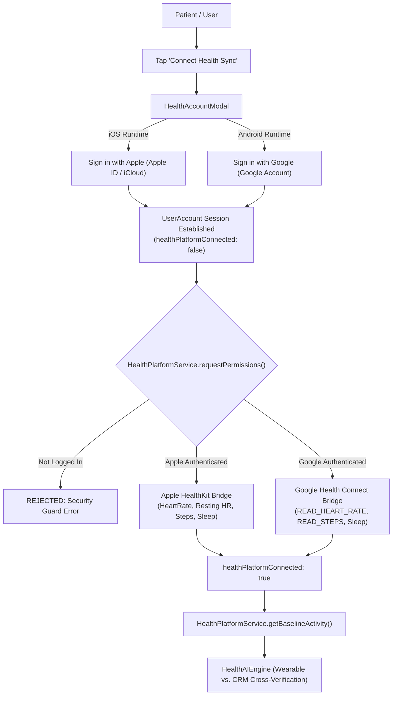

# Aura AI Coach 🫀

[](LICENSE)
[](.github/workflows/ci.yml)
[](https://github.com/hoomanp/aura-ai-coach)
[](https://github.com/hoomanp/aura-ai-coach)
[](https://github.com/hoomanp/aura-ai-coach)
[](tsconfig.json)
[](https://expo.dev)
[](https://reactnative.dev)

**Aura AI Coach** is an open-source, production-grade Expo / React Native mobile application demonstrating an intelligent, context-aware cardiac wellness coaching architecture for individuals with implanted Cardiac Rhythm Management (CRM) devices (pacemakers, implantable cardioverter-defibrillators [ICDs], and cardiac resynchronization therapy [CRT] devices).

The application synchronizes simulated telemetry data via Bluetooth Low Energy (BLE) and Merlin.net-style remote gateways, delivering personalized wellness insights, safe target heart-rate intensity zones, thoracic impedance (fluid accumulation) monitoring, medication reminders, and trend analytics directly on device.

> [!CAUTION]
> **MEDICAL & REGULATORY DISCLAIMER:**
> Aura AI Coach is an experimental open-source educational demonstration and research application. **It is NOT a Medical Device (Software as a Medical Device - SaMD) and is NOT intended for the diagnosis, cure, mitigation, treatment, or prevention of any medical condition or cardiac arrhythmia.** Always consult with a board-certified electrophysiologist or cardiologist. In case of an acute emergency (chest pain, shortness of breath, dizziness, or unexpected ICD shock), **immediately dial 911 or your local emergency services.** See [DISCLAIMER.md](DISCLAIMER.md) for full trademark and regulatory disclosures.

---

## 🏛️ System Architecture

```
┌─────────────────────────────────────────────────────────────────────────────┐
│                             Aura Mobile Client                              │
│            (Expo SDK 55 · React Native 0.83.2 · TypeScript Strict)          │
│                                                                             │
│   ┌──────────────────┐   ┌──────────────────┐   ┌───────────────────────┐   │
│   │ Telemetry Dash   │   │  7-Day Analytics │   │    AI Coach & Chat    │   │
│   │ Live BLE Stream  │   │  Trend Charts    │   │ Priority 0 Triage     │   │
│   │ Safe Zone Ring   │   │  Victory SVG     │   │ Contextual Guardrails │   │
│   └────────▲─────────┘   └────────▲─────────┘   └───────────▲───────────┘   │
└────────────┼──────────────────────┼─────────────────────────┼───────────────┘
             │                      │                         │
             ▼                      ▼                         ▼
┌─────────────────────────────────────────────────────────────────────────────┐
│                          Clinical AI & Safety Engine                        │
│   · HealthAIEngine: Dynamic Safe Zone Calculation & Fluid Status Monitor    │
│   · Priority 0 Acute Emergency Triage Layer (Chest Pain, Syncope, ICD Shock)│
│   · Physiological Clamping Bounds (HR 30–220 BPM, Impedance 20–200 Ω)       │
└─────────────────────────────────────────────────────────────────────────────┘
             ▲                                                ▲
             │                                                │
   ┌─────────┴─────────────┐                        ┌─────────┴─────────────┐
   │   SecureBLEService    │                        │ SecureMerlinNetService│
   │ (Encrypted BLE Stream │                        │ (FHIR Input Sanitize  │
   │  TLS Challenge-Resp)  │                        │  TLS 1.3 Simulation)  │
   └───────────────────────┘                        └───────────────────────┘
             ▲                                                ▲
             │                                                │
┌────────────┴────────────────────────────────────────────────┴───────────────┐
│                    Health Ecosystem Integration Gateway                     │
│                        (HealthPlatformService.ts)                           │
│                                                                             │
│    ┌──────────────────────────────────┐  ┌─────────────────────────────┐    │
│    │      iOS: Apple HealthKit        │  │ Android: Google Health Conn │    │
│    │ Gated by: Apple ID (iCloud) Auth │  │ Gated by: Google Account    │    │
│    │ HR, Resting HR, Steps, Sleep     │  │ READ_HEART_RATE, Steps, HR  │    │
│    └──────────────────────────────────┘  └─────────────────────────────┘    │
└─────────────────────────────────────────────────────────────────────────────┘
```

---

## 📱 Features & Capabilities

| Feature | Description |
| :--- | :--- |
| **Live Telemetry Dashboard** | Real-time cardiac telemetry metrics: heart rate, pacing percentage, thoracic impedance (fluid status), AFib burden, battery status, and daily AI coaching insight. |
| **Apple Health & Health Connect** | Native health platform integration gated by **Apple ID** (iOS) and **Google Account** (Android) with verified consent and wearable cross-checks. |
| **7-Day Trend History** | Visual telemetry charts powered by `victory-native` + `react-native-svg` tracking weekly heart rate averages, fluid impedance trends, and pacing burdens. |
| **AI Coach & Emergency Triage** | Context-aware chat engine with a **Priority 0 clinical emergency detection layer** that immediately routes acute cardiac symptoms to 911 emergency services. |
| **Safe Intensity Zone Ring** | Dynamic cardiovascular intensity zones recalculated based on the patient's device programmed lower and upper rate pacing limits. |
| **Zero-Trust Permission Gate** | Interactive consent modals (`ConsentModal`, `HealthAccountModal`) protecting BLE connections and external health data repositories. |
| **God Mode (QA Simulation)** | Deterministic test state (`StubDataService`) enabling complete UI/UX evaluation and regression testing without physical CRM hardware. |

---

## 🍎 Apple HealthKit & 🤖 Google Health Connect Integration

Aura AI Coach bridges consumer wearables with clinical CRM telemetry through a strict **identity-gated authentication architecture**:



### Entitlements & Permissions Configured:
- **iOS (`app.json`):**
  - Entitlement: `com.apple.developer.healthkit`
  - Usage descriptions: `NSHealthShareUsageDescription` and `NSHealthUpdateUsageDescription`
- **Android (`app.json`):**
  - Manifest intent: `androidx.health.connect.client.HEALTH_CONNECT_ACTION`
  - Permissions: `android.permission.health.READ_HEART_RATE`, `android.permission.health.READ_STEPS`, `android.permission.health.READ_SLEEP`
- **Testing & Simulation:** When running on simulators, web, or Expo Go without physical biometric sensors, the gateway provides high-fidelity simulated telemetry tagged as `'Simulated Platform'`.

---

## 🛠️ Tech Stack

- **Mobile Framework:** [Expo SDK 55](https://expo.dev) with [React Native 0.83.2](https://reactnative.dev)
- **Language:** TypeScript 5.9 (Strict mode enabled)
- **Navigation:** [React Navigation 7](https://reactnavigation.org) (Bottom Tabs)
- **Data Visualization:** `victory-native` & `react-native-svg`
- **Icons & Styling:** `@expo/vector-icons` (Ionicons), custom design system tokens
- **Quality & Testing:** Jest 29, `ts-jest`, ESLint 9 (Flat Config), `@typescript-eslint`
- **CI/CD:** GitHub Actions (Lint, Typecheck, Test Coverage, Gitleaks, npm Audit)

---

## 🚀 Getting Started

### Prerequisites

- Node.js 20+ or 22 LTS (`node --version`)
- npm 10+ (`npm --version`)
- iOS Simulator (macOS with Xcode) or Android Emulator (Android Studio)

### Installation

```bash
# 1. Clone the repository
git clone https://github.com/hoomanp/aura-ai-coach.git
cd aura-ai-coach

# 2. Copy environment configuration
cp .env.example .env

# 3. Install dependencies (audited with 0 vulnerabilities)
npm install
```

### Development

```bash
# Start the Expo development server
npm run start

# Launch on iOS Simulator
npm run ios

# Launch on Android Emulator
npm run android

# Start in God Mode (preloaded demo data for instant evaluation)
APP_ENV=demo npm run start
```

---

## 🧪 Staff STE Quality Gates & 2-Day Simulation

The repository enforces strict Staff Software Test Engineer (STE) quality gates:

```bash
# 1. Typecheck: Verify strict TypeScript compilation with zero errors
npm run typecheck

# 2. Linting: Verify ESLint 9 flat rules and code standards
npm run lint

# 3. Unit & Integration Tests: Run all 78 tests across 7 test suites
npm test

# 4. Test Coverage: Generate coverage reports (96.5% overall lines)
npm run test:coverage
```

### Test Suite Summary

```
PASS src/services/HealthPlatformService.test.ts   (12 tests) - Apple ID, Google Account, permission gating
PASS src/services/SecuritySanitization.test.ts    (13 tests) - Patient ID injection sanitization
PASS src/services/TelemetrySimulation2Day.test.ts  (6 tests) - 48-hour continuous diurnal & drift validation
PASS src/verification_flow.test.ts                (2 tests) - End-to-end telemetry verification flow
PASS src/services/StubDataService.test.ts         (20 tests) - Deterministic mock data generation
PASS src/ai/HealthAIEngine.emergency.test.ts      (11 tests) - Priority 0 emergency symptom triage
PASS src/ai/HealthAIEngine.test.ts                (14 tests) - Safe zones, fluid detection, chat heuristics

Test Suites: 7 passed, 7 total
Tests:       78 passed, 78 total
Coverage:    96.5% Lines | 96.1% Statements | 96.9% Functions
```

### Continuous 2-Day (48-Hour) Simulation & Validation

[`src/services/TelemetrySimulation2Day.test.ts`](src/services/TelemetrySimulation2Day.test.ts) simulates an end-to-end 48-hour continuous telemetry stream:
- **Diurnal Circadian Rhythm:** Day/night heart rate fluctuations (60 BPM resting nocturnal rate to 85 BPM waking rate).
- **Subclinical Fluid Decompensation:** Day 2 thoracic impedance decline (<110 Ω) accurately triggering early fluid warnings before clinical decompensation.
- **Memory & Pruning Stability:** Rolling 24-hour window retention (`HealthAIEngine.purgeOldTelemetry`) verifying that memory does not leak over extended continuous telemetry acquisition.
- **Emergency Triage Guardrails:** Urgent symptom recognition ("chest pain", "passed out", "ICD shock") overriding standard chat responses to prompt immediate 911 contact.

---

## 📂 Project Structure

```
aura-ai-coach/
├── .github/
│   └── workflows/
│       └── ci.yml               # GitHub Actions CI workflow (lint, typecheck, test, gitleaks)
├── __mocks__/
│   └── react-native.js          # React Native mock module for node test runner
├── assets/                      # Icons, splash screens, adaptive icons
├── docs/                        # Architecture specs, EAS setup, design guides
├── src/
│   ├── ai/
│   │   ├── HealthAIEngine.ts             # Stateless clinical heuristics & triage engine
│   │   ├── HealthAIEngine.test.ts        # AI engine unit tests
│   │   └── HealthAIEngine.emergency.test.ts # Emergency triage & safety guardrail tests
│   ├── components/
│   │   ├── ChatBubble.tsx       # AI and patient chat bubbles
│   │   ├── ConsentModal.tsx     # Explicit permission and consent dialog
│   │   ├── HealthAccountModal.tsx # Apple ID / Google Account sign-in dialog
│   │   ├── ReminderCard.tsx     # Interactive care reminders
│   │   └── TrendChart.tsx       # Reusable SVG telemetry chart wrapper
│   ├── models/
│   │   └── health.ts            # Type definitions: Telemetry, Pacing, UserAccount
│   ├── screens/
│   │   ├── AICoachScreen.tsx    # Interactive AI coach screen
│   │   ├── DashboardScreen.tsx  # Live telemetry dashboard screen
│   │   └── HistoryScreen.tsx    # 7-day trend analytics screen
│   ├── services/
│   │   ├── BLEService.ts                 # BLE stream simulation with clean teardown
│   │   ├── HealthPlatformService.ts      # HealthKit / Health Connect gateway
│   │   ├── HealthPlatformService.test.ts # Health platform auth & permission tests
│   │   ├── MerlinNetService.ts           # Sanitized remote telemetry gateway
│   │   ├── StubDataService.ts            # Deterministic God Mode test data
│   │   ├── StubDataService.test.ts       # StubDataService unit tests
│   │   ├── SecuritySanitization.test.ts  # Input sanitization & injection tests
│   │   └── TelemetrySimulation2Day.test.ts # 48-hour continuous simulation tests
│   ├── theme/
│   │   └── Theme.ts             # Theme tokens, colors, typography, legal notices
│   └── types/                   # Ambient TypeScript declarations
├── App.tsx                      # Root component with Tab Navigation
├── app.json                     # Expo application configuration & entitlements
├── eas.json                     # EAS build profiles (Node 22 LTS)
├── eslint.config.js             # Modern ESLint Flat Config
├── jest.config.js               # Jest configuration
├── package.json                 # Project dependencies & scripts
├── tsconfig.json                # TypeScript strict configuration
├── DISCLAIMER.md                # Medical device & trademark disclaimer
├── SECURITY.md                  # Vulnerability disclosure policy
├── CONTRIBUTING.md              # Contributor guidelines & standards
├── CODE_OF_CONDUCT.md           # Contributor Covenant
└── LICENSE                      # MIT Open Source License
```

---

## 🔒 Security & Secrets Hygiene

- **Zero Tracked Credentials:** `credentials/` and `credentials.json` are excluded in `.gitignore`. A safe template is provided in `credentials.example.json`.
- **Gitleaks CI Scanning:** Automated pre-commit and CI scans prevent accidental secret leaks.
- **Sanitized Inputs:** Patient identifiers are sanitized to alphanumeric characters (`[a-zA-Z0-9-]`) across all network services to eliminate injection attack vectors.
- **Dependency Audit:** Zero npm vulnerabilities via package overrides (`image-size`, `uuid`) and `npm audit`.

---

## 🤝 Contributing & License

Contributions, feature requests, and bug reports are welcome! Please read [CONTRIBUTING.md](CONTRIBUTING.md) and [CODE_OF_CONDUCT.md](CODE_OF_CONDUCT.md) before opening a pull request.

Released under the [MIT License](LICENSE).  
Copyright © 2026 Hooman Parta and Contributors.
