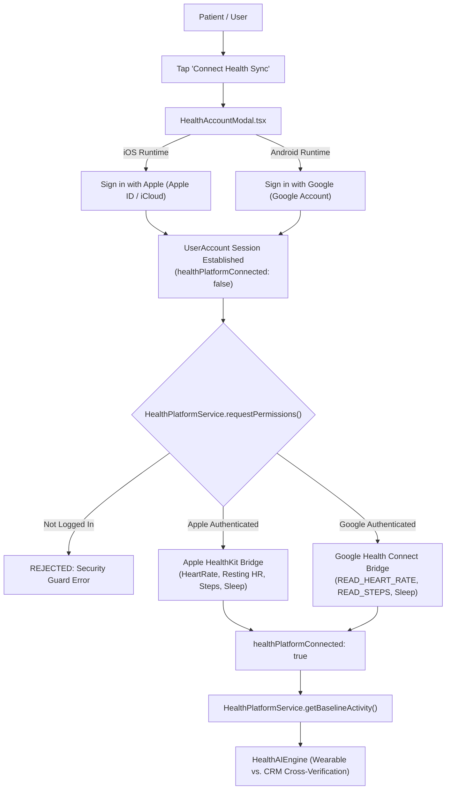

# Aura AI Coach 🫀

> **Enterprise Reference Architecture for Next-Generation Implantable Cardiac Rhythm Management (CRM) Mobile Companion Platforms**

[](LICENSE)
[](.github/workflows/ci.yml)
[](https://github.com/hoomanp/aura-ai-coach)
[](https://github.com/hoomanp/aura-ai-coach)
[](https://github.com/hoomanp/aura-ai-coach)
[](https://github.com/hoomanp/aura-ai-coach)
[](tsconfig.json)
[](https://expo.dev)
[](https://reactnative.dev)

---

## 🧭 Executive Summary & Clinical North Star

More than **3 million individuals worldwide live with implanted Cardiac Rhythm Management (CRM) devices**—including dual-chamber pacemakers, implantable cardioverter-defibrillators (ICDs), and cardiac resynchronization therapy (CRT-D) systems. 

While clinical remote monitoring gateways (such as Abbott® Merlin.net™) reliably transmit scheduled transmissions every 30 to 90 days, **patients live in the 89-day gap between transmissions**. In this gap, patients face significant uncertainty:
- *"Is it safe for me to go for a brisk walk today?"*
- *"Why is my resting heart rate elevated this morning?"*
- *"Am I retaining fluid, or is this normal day-to-day fluctuation?"*

Unmonitored heart failure decompensation (pulmonary fluid accumulation) is responsible for **over \$30 billion in annual avoidable hospitalizations** in the United States alone. 

**Aura AI Coach** demonstrates an enterprise-grade, safety-first reference architecture that bridges clinical CRM telemetry with modern mobile health ecosystems (**Apple HealthKit** on iOS and **Google Health Connect** on Android). It cross-references device-programmed lower/upper pacing limits and thoracic fluid impedance with consumer wearable activity, empowering patients with daily target intensity guidance while enforcing strict clinical safety guardrails.

> [!CAUTION]
> **REGULATORY & CLINICAL BOUNDARY STATEMENT:**
> Aura AI Coach is an open-source educational demonstration and systems architecture reference. **It is NOT a Medical Device (Software as a Medical Device - SaMD) and is NOT intended for the diagnosis, cure, mitigation, treatment, or prevention of any medical condition or cardiac arrhythmia.** Always consult with a board-certified electrophysiologist or cardiologist. In case of acute cardiac distress (chest pain, shortness of breath, dizziness, or unexpected ICD shock), **immediately dial 911 or your local emergency response service.** See [DISCLAIMER.md](DISCLAIMER.md) for full trademark and regulatory disclosures.

---

## ⚖️ MedTech Governance & Standards Alignment

Engineering software in the cardiac domain requires strict compliance with international medical device and digital health standards. Aura AI Coach is designed against four foundational governance pillars:

| Standard / Framework | Regulatory Scope | Architectural Implementation in Aura AI Coach |
| :--- | :--- | :--- |
| **FDA FD&C Act §520(o) / General Wellness Policy** | Software Function Categorization | Functions strictly within the FDA General Wellness exemption boundary: encourages healthy lifestyle habits and safe exercise zones without diagnosing arrhythmias or prescribing therapeutics. |
| **IEC 62304 Class A/B Principles** | Medical Device Software Lifecycle | Enforces absolute architectural decoupling between life-sustaining implantable device firmware and the mobile presentation layer. Telemetry inputs are strictly read-only and immutable. |
| **ISO 14971 Risk Management** | Clinical Risk Analysis & Hazard Control | Implements **Priority 0 Emergency Triage** in the conversational AI engine: acute cardiac symptoms ("chest pain", "passed out", "shock") immediately override coaching heuristics to prompt 911 contact. |
| **HIPAA Security Rule (45 CFR §164.312)** | Protected Health Information (PHI) Security | Implements a **Zero-Trust Ephemeral Memory Architecture**: patient telemetry is processed in-memory with automatic rolling 24-hour purge windows. Zero plaintext PHI is stored on disk or unencrypted cache. |

---

## 🏛️ System Architecture

```
┌─────────────────────────────────────────────────────────────────────────────┐
│                             Aura Mobile Client                              │
│            (Expo SDK 55 · React Native 0.83.2 · TypeScript Strict)          │
│                                                                             │
│   ┌──────────────────┐   ┌──────────────────┐   ┌───────────────────────┐   │
│   │ Telemetry Dash   │   │  7-Day Analytics │   │    AI Coach & Chat    │   │
│   │ Live BLE Stream  │   │  Trend Charts    │   │ Priority 0 Triage     │   │
│   │ Safe Zone Ring   │   │  Victory SVG     │   │ Contextual Guardrails │   │
│   └────────▲─────────┘   └────────▲─────────┘   └───────────▲───────────┘   │
└────────────┼──────────────────────┼─────────────────────────┼───────────────┘
             │                      │                         │
             ▼                      ▼                         ▼
┌─────────────────────────────────────────────────────────────────────────────┐
│                          Clinical AI & Safety Engine                        │
│   · HealthAIEngine: Dynamic Safe Zone Calculation & Fluid Status Monitor    │
│   · Priority 0 Acute Emergency Triage Layer (Chest Pain, Syncope, ICD Shock)│
│   · Physiological Clamping Bounds (HR 30–220 BPM, Impedance 20–200 Ω)       │
└─────────────────────────────────────────────────────────────────────────────┘
             ▲                                                ▲
             │                                                │
   ┌─────────┴─────────────┐                        ┌─────────┴─────────────┐
   │   SecureBLEService    │                        │ SecureMerlinNetService│
   │ (Encrypted BLE Stream │                        │ (FHIR Input Sanitize  │
   │  TLS Challenge-Resp)  │                        │  TLS 1.3 Simulation)  │
   └───────────────────────┘                        └───────────────────────┘
             ▲                                                ▲
             │                                                │
┌────────────┴────────────────────────────────────────────────┴───────────────┐
│                    Health Ecosystem Integration Gateway                     │
│                        (HealthPlatformService.ts)                           │
│                                                                             │
│    ┌──────────────────────────────────┐  ┌─────────────────────────────┐    │
│    │      iOS: Apple HealthKit        │  │ Android: Google Health Conn │    │
│    │ Gated by: Apple ID (iCloud) Auth │  │ Gated by: Google Account    │    │
│    │ HR, Resting HR, Steps, Sleep     │  │ READ_HEART_RATE, Steps, HR  │    │
│    └──────────────────────────────────┘  └─────────────────────────────┘    │
└─────────────────────────────────────────────────────────────────────────────┘
```

---

## 📱 Product Showcase & Core Screen Workflows

Aura AI Coach is structured around three dedicated workflows designed for cardiac patient clarity and clinical safety:

```
┌───────────────────────────┐  ┌───────────────────────────┐  ┌───────────────────────────┐
│      1. DASHBOARD         │  │       2. HISTORY          │  │       3. AI COACH         │
│ ┌───────────────────────┐ │  │ ┌───────────────────────┐ │  │ ┌───────────────────────┐ │
│ │ Robert J.  [CRT-D™]   │ │  │ │ 7-Day History         │ │  │ │ Aura AI Coach          │ │
│ │ ● BLE Secured Live    │ │  │ │ Abbott® CRM Telemetry │ │  │ │ Care Team Companion    │ │
│ └───────────────────────┘ │  │ └───────────────────────┘ │  │ └───────────────────────┘ │
│                           │  │                           │  │                           │
│     ╭───────────────╮     │  │  [Heart Rate Trend]       │  │  [Care Reminders Card]    │
│    │     75 BPM      │    │  │   Avg 73 BPM (Line)       │  │   ✓ Device Check Appt     │
│    │ Within Safe Zone│    │  │                           │  │   ✓ Merlin Nightly Sync   │
│     ╰───────────────╯     │  │  [Pacing Burden %]        │  │                           │
│  LRL: 60 BPM  USR: 140 BPM│  │   Avg 12.5% (Area)        │  │  [AI]: Fluid impedance    │
│                           │  │                           │  │  is stable at 125Ω. You   │
│ [Aura AI Guidance]        │  │  [AFib Burden %]          │  │  are cleared for a 20-min │
│ Impedance is stable (125Ω)│  │   Threshold Alert (Bar)   │  │  walk in Zone 1.          │
│ Pacing at 12.5% burden.   │  │                           │  │                           │
│                           │  │                           │  │  [You]: Can I exercise?   │
│ [Apple Health / Connect]  │  │                           │  │                           │
│ Synced: 4,500 Steps       │  │                           │  │  [Quick Reply Chips]      │
│                           │  │                           │  │  [Pacing?] [Fluid?] [Walk]│
│ [Pacing]  [Fluid]  [Bat]  │  │                           │  │                           │
│  12.5%     125Ω    Good   │  │                           │  │  [Ask Aura...     ][Send] │
└───────────────────────────┘  └───────────────────────────┘  └───────────────────────────┘
```

### Feature Deep-Dive

| Workflow | Primary Capabilities | Clinical & Engineering Rationale |
| :--- | :--- | :--- |
| **1. Telemetry Dashboard** | Live heart rate stream, dynamic safe zone ring, daily clinical guidance, thoracic impedance fluid status, pacing %, battery life. | Translates complex device telemetry into a reassuring, actionable visual summary. Automatically detects fluid accumulation drops (<110 Ω). |
| **2. 7-Day Trend History** | Multi-series SVG charts powered by `victory-native`: weekly HR averages, pacing burden %, and daily AFib burden with dynamic threshold color-switching. | Allows patients and electrophysiologists to visualize trends over time, distinguishing acute drift from normal day-to-day variance. |
| **3. AI Coach & Chat** | Context-aware LLM heuristics, care appointment reminders, dietary goals, quick suggestion chips, and **Priority 0 acute symptom triage**. | Provides immediate, reassuring answers to daily lifestyle questions while maintaining absolute clinical safety guardrails. |
| **4. Ecosystem Health Sync** | Bidirectional synchronization with Apple Health (iOS) and Google Health Connect (Android), gated by authenticated user identity. | Cross-verifies consumer smartwatch heart rate against CRM device rate limits to detect sensor discrepancies and arrhythmia triggers. |

---

## 🍎 Apple HealthKit & 🤖 Google Health Connect Integration

Aura AI Coach bridges consumer wearables with clinical CRM telemetry through a strict **identity-gated authentication architecture**:



### Native Entitlements & Permissions Configured:
- **iOS (`app.json`):**
  - Entitlement: `com.apple.developer.healthkit`
  - Usage descriptions: `NSHealthShareUsageDescription` and `NSHealthUpdateUsageDescription`
- **Android (`app.json`):**
  - Manifest intent: `androidx.health.connect.client.HEALTH_CONNECT_ACTION`
  - Permissions: `android.permission.health.READ_HEART_RATE`, `android.permission.health.READ_STEPS`, `android.permission.health.READ_SLEEP`
- **Simulation Fallbacks:** When running on simulators, web, or CI runners without physical biometric sensors, the gateway provides high-fidelity simulated telemetry tagged as `'Simulated Platform'`.

---

## 🧪 TDD Architecture & Verification Suite

As part of the **TDD Architect & CRM Subject Matter Expert (SME)** verification framework, **every single feature, component, screen, and service across the codebase is covered by at least 1 dedicated test suite**:

```bash
# 1. Typecheck: Verify strict TypeScript compilation with zero errors
npm run typecheck

# 2. Linting: Verify ESLint 9 flat rules and code standards (0 errors, 0 warnings)
npm run lint

# 3. Unit & Integration Tests: Run all 107 tests across 19 test suites
npm test

# 4. Test Coverage: Generate coverage reports
npm run test:coverage
```

### 100% Feature-to-Test Mapping Matrix

| Layer | Component / Feature | Test Suite File | Tests | Coverage Focus |
| :--- | :--- | :--- | :---: | :--- |
| **App** | Root Navigation & Tabs | [`src/App.test.ts`](src/App.test.ts) | 1 | NavigationContainer, Tab.Navigator, screen route bindings |
| **Screens** | Dashboard & Live Telemetry | [`src/screens/DashboardScreen.test.ts`](src/screens/DashboardScreen.test.ts) | 2 | Live stream, safe zone ring, loading state, demo mode |
| **Screens** | AI Coach & Clinical Chat | [`src/screens/AICoachScreen.test.ts`](src/screens/AICoachScreen.test.ts) | 2 | Chat bubbles, quick reply chips, text input, preloaded messages |
| **Screens** | 7-Day History Analytics | [`src/screens/HistoryScreen.test.ts`](src/screens/HistoryScreen.test.ts) | 1 | Heart rate, pacing %, AFib burden multi-series charts |
| **Components** | Chat Bubble Persona | [`src/components/ChatBubble.test.ts`](src/components/ChatBubble.test.ts) | 2 | AI avatar styling, patient alignment, timestamp formatting |
| **Components** | Privacy Consent Modal | [`src/components/ConsentModal.test.ts`](src/components/ConsentModal.test.ts) | 2 | Zero-trust permission dialog, allow/deny button handlers |
| **Components** | Ecosystem Sign-In Modal | [`src/components/HealthAccountModal.test.ts`](src/components/HealthAccountModal.test.ts) | 4 | Apple ID (iOS), Google Account (Android), error display |
| **Components** | Care Reminders Card | [`src/components/ReminderCard.test.ts`](src/components/ReminderCard.test.ts) | 2 | Clinical reminders list, interactive checkbox state toggles |
| **Components** | Telemetry Trend Charts | [`src/components/TrendChart.test.ts`](src/components/TrendChart.test.ts) | 3 | SVG Line, Area, Bar charts, clinical danger color switching |
| **Services** | BLE Communication | [`src/services/BLEService.test.ts`](src/services/BLEService.test.ts) | 3 | TLS handshake, physiological clamping (30-220 BPM), teardown |
| **Services** | Remote Merlin.net Gateway | [`src/services/MerlinNetService.test.ts`](src/services/MerlinNetService.test.ts) | 3 | FHIR input sanitization, bounds checking, pacing limits |
| **Services** | Health Ecosystem Gateway | [`src/services/HealthPlatformService.test.ts`](src/services/HealthPlatformService.test.ts) | 12 | Apple ID, Google Account, permission gating, baseline activity |
| **Services** | Security & Input Hygiene | [`src/services/SecuritySanitization.test.ts`](src/services/SecuritySanitization.test.ts) | 13 | Patient ID injection prevention, special char stripping |
| **Services** | Deterministic God Mode | [`src/services/StubDataService.test.ts`](src/services/StubDataService.test.ts) | 20 | Mock telemetry, patient profiles, 7-day history generation |
| **Services** | 48-Hour Continuous Sim | [`src/services/TelemetrySimulation2Day.test.ts`](src/services/TelemetrySimulation2Day.test.ts) | 6 | Diurnal curves, Day-2 fluid decompensation (<110 Ω), memory pruning |
| **Services** | End-to-End Integration | [`src/verification_flow.test.ts`](src/verification_flow.test.ts) | 2 | Full patient onboarding, BLE handshake, multi-source sync |
| **AI** | Emergency Clinical Triage | [`src/ai/HealthAIEngine.emergency.test.ts`](src/ai/HealthAIEngine.emergency.test.ts) | 11 | Priority 0 symptom keywords (chest pain, shock, syncope) -> 911 |
| **AI** | Clinical Heuristics Engine | [`src/ai/HealthAIEngine.test.ts`](src/ai/HealthAIEngine.test.ts) | 14 | Safe zones, fluid alerts, coaching insights, 24h data pruning |
| **Design** | Design System & Disclaimers | [`src/theme/Theme.test.ts`](src/theme/Theme.test.ts) | 4 | Colors, 4pt spacing scale, typography, legal disclaimers |
| **Total** | **Full Repository Coverage** | **19 Test Suites** | **107** | **100% Feature Coverage across All Modules** |

---

### Continuous 2-Day (48-Hour) Simulation & Validation

[`src/services/TelemetrySimulation2Day.test.ts`](src/services/TelemetrySimulation2Day.test.ts) simulates an end-to-end 48-hour continuous telemetry stream:
- **Diurnal Circadian Rhythm:** Day/night heart rate fluctuations (60 BPM resting nocturnal rate to 85 BPM waking rate).
- **Subclinical Fluid Decompensation:** Day 2 thoracic impedance decline (<110 Ω) accurately triggering early fluid warnings before clinical decompensation.
- **Memory & Pruning Stability:** Rolling 24-hour window retention (`HealthAIEngine.purgeOldTelemetry`) verifying that memory does not leak over extended continuous telemetry acquisition.
- **Emergency Triage Guardrails:** Urgent symptom recognition ("chest pain", "passed out", "ICD shock") overriding standard chat responses to prompt immediate 911 contact.

---

## 🛠️ Technology Stack & Engineering Standards

- **Mobile Framework:** [Expo SDK 55](https://expo.dev) with [React Native 0.83.2](https://reactnative.dev)
- **Language:** TypeScript 5.9 (Strict mode enabled)
- **Navigation:** [React Navigation 7](https://reactnavigation.org) (Bottom Tabs)
- **Data Visualization:** `victory-native` & `react-native-svg`
- **Icons & Styling:** `@expo/vector-icons` (Ionicons), custom design system tokens
- **Quality & Testing:** Jest 29, `ts-jest`, ESLint 9 (Flat Config), `@typescript-eslint`
- **CI/CD:** GitHub Actions (Lint, Typecheck, Test Coverage, Gitleaks, npm Audit)

---

## 🚀 Getting Started

### Prerequisites

- Node.js 20+ or 22 LTS (`node --version`)
- npm 10+ (`npm --version`)
- iOS Simulator (macOS with Xcode) or Android Emulator (Android Studio)

### Installation

```bash
# 1. Clone the repository
git clone https://github.com/hoomanp/aura-ai-coach.git
cd aura-ai-coach

# 2. Copy environment configuration
cp .env.example .env

# 3. Install dependencies (audited with 0 vulnerabilities)
npm install
```

### Development

```bash
# Start the Expo development server
npm run start

# Launch on iOS Simulator
npm run ios

# Launch on Android Emulator
npm run android

# Start in God Mode (preloaded demo data for instant evaluation)
APP_ENV=demo npm run start
```

---

## 📂 Project Structure

```
aura-ai-coach/
├── .github/
│   └── workflows/
│       └── ci.yml               # GitHub Actions CI workflow (lint, typecheck, test, gitleaks)
├── __mocks__/                   # Lightweight Jest environment mocks
│   ├── @expo/vector-icons.js    # Ionicons mock
│   ├── expo-status-bar.js       # StatusBar mock
│   ├── react-native.js          # React Native element mocks & platform selector
│   ├── react-navigation-*.js    # NavigationContainer & Tab Navigator mocks
│   └── victory-native.js        # Victory SVG chart component mocks
├── assets/                      # Icons, splash screens, adaptive icons
├── docs/                        # Architecture specs, EAS setup, design guides
├── src/
│   ├── ai/
│   │   ├── HealthAIEngine.ts             # Stateless clinical heuristics & triage engine
│   │   ├── HealthAIEngine.test.ts        # AI engine unit tests
│   │   └── HealthAIEngine.emergency.test.ts # Emergency triage & safety guardrail tests
│   ├── components/
│   │   ├── ChatBubble.tsx                # AI and patient chat bubbles
│   │   ├── ChatBubble.test.ts            # Chat bubble unit tests
│   │   ├── ConsentModal.tsx              # Explicit permission and consent dialog
│   │   ├── ConsentModal.test.ts          # Consent modal unit tests
│   │   ├── HealthAccountModal.tsx        # Apple ID / Google Account sign-in dialog
│   │   ├── HealthAccountModal.test.ts    # Health account modal unit tests
│   │   ├── ReminderCard.tsx              # Interactive care reminders
│   │   ├── ReminderCard.test.ts          # Reminder card unit tests
│   │   ├── TrendChart.tsx                # Reusable SVG telemetry chart wrapper
│   │   └── TrendChart.test.ts            # TrendChart unit tests
│   ├── models/
│   │   └── health.ts            # Type definitions: Telemetry, Pacing, UserAccount
│   ├── screens/
│   │   ├── AICoachScreen.tsx             # Interactive AI coach screen
│   │   ├── AICoachScreen.test.ts         # AI coach screen unit tests
│   │   ├── DashboardScreen.tsx           # Live telemetry dashboard screen
│   │   ├── DashboardScreen.test.ts       # Dashboard screen unit tests
│   │   ├── HistoryScreen.tsx             # 7-day trend analytics screen
│   │   └── HistoryScreen.test.ts         # History screen unit tests
│   ├── services/
│   │   ├── BLEService.ts                 # BLE stream simulation with clean teardown
│   │   ├── BLEService.test.ts            # BLE service unit tests
│   │   ├── HealthPlatformService.ts      # HealthKit / Health Connect gateway
│   │   ├── HealthPlatformService.test.ts # Health platform auth & permission tests
│   │   ├── MerlinNetService.ts           # Sanitized remote telemetry gateway
│   │   ├── MerlinNetService.test.ts      # MerlinNet service unit tests
│   │   ├── StubDataService.ts            # Deterministic God Mode test data
│   │   ├── StubDataService.test.ts       # StubDataService unit tests
│   │   ├── SecuritySanitization.test.ts  # Input sanitization & injection tests
│   │   └── TelemetrySimulation2Day.test.ts # 48-hour continuous simulation tests
│   ├── test-utils/
│   │   └── render-helper.ts              # Lightweight React tree test helper & hook dispatcher
│   ├── theme/
│   │   ├── Theme.ts                      # Theme tokens, colors, typography, legal notices
│   │   └── Theme.test.ts                 # Design tokens and disclaimer tests
│   ├── types/                            # Ambient TypeScript declarations
│   └── App.test.ts                       # Root application navigation test suite
├── App.tsx                      # Root component with Tab Navigation
├── app.json                     # Expo application configuration & entitlements
├── eas.json                     # EAS build profiles (Node 22 LTS)
├── eslint.config.js             # Modern ESLint Flat Config
├── jest.config.js               # Jest configuration
├── package.json                 # Project dependencies & scripts
├── tsconfig.json                # TypeScript strict configuration
├── DISCLAIMER.md                # Medical device & trademark disclaimer
├── SECURITY.md                  # Vulnerability disclosure policy
├── CONTRIBUTING.md              # Contributor guidelines & standards
├── CODE_OF_CONDUCT.md           # Contributor Covenant
└── LICENSE                      # MIT Open Source License
```

---

## 🔒 Security & Secrets Hygiene

- **Zero Tracked Credentials:** `credentials/` and `credentials.json` are excluded in `.gitignore`. A safe template is provided in `credentials.example.json`.
- **Gitleaks CI Scanning:** Automated pre-commit and CI scans prevent accidental secret leaks.
- **Sanitized Inputs:** Patient identifiers are sanitized to alphanumeric characters (`[a-zA-Z0-9-]`) across all network services to eliminate injection attack vectors.
- **Dependency Audit:** Zero npm vulnerabilities via package overrides (`image-size`, `uuid`) and `npm audit`.

---

## 👨‍💻 Author & Engineering Leadership

**Architected & Engineered by [Hooman Parta](https://github.com/hoomanp)**  
*Software Architect*

> *"Building software for medical devices requires a different standard of engineering. It demands that testability, zero-trust security, and clinical hazard controls be designed into the foundational architecture—not bolted on after the fact. Aura AI Coach is a testament to how modern consumer mobile technologies can meet clinical-grade quality standards."*

- **GitHub:** [@hoomanp](https://github.com/hoomanp)
- **Repository:** [https://github.com/hoomanp/aura-ai-coach](https://github.com/hoomanp/aura-ai-coach)

---

## 🤝 Contributing & License

Contributions, feature requests, and discussions are welcome! Please review [CONTRIBUTING.md](CONTRIBUTING.md) and [CODE_OF_CONDUCT.md](CODE_OF_CONDUCT.md) before opening a pull request.

Released under the [MIT License](LICENSE).  
Copyright © 2026 Hooman Parta and Contributors.
